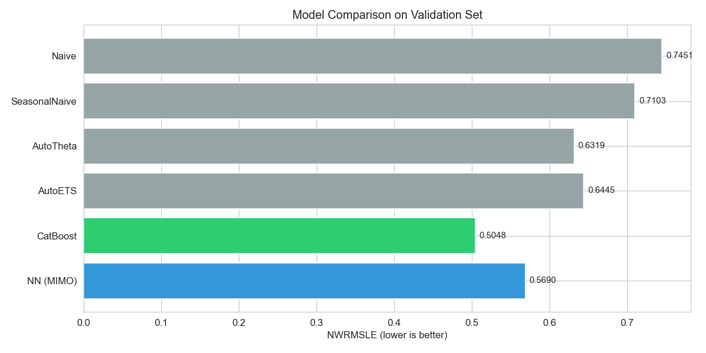

# Favorita Grocery Sales Forecasting

**HSE, Анализ временных рядов, 2025–2026**
Команда: **Степан Панкратов** (пайплайн, модели, эксперименты) · **Максим Сидоров** (EDA, анализ ошибок, отчёт)

Kaggle-соревнование [Corporación Favorita Grocery Sales Forecasting](https://www.kaggle.com/c/favorita-grocery-sales-forecasting): прогноз ежедневных продаж 4000+ товаров в 54 магазинах Эквадора на 16 дней вперёд. Метрика — **NWRMSLE** (взвешенный RMSLE, скоропортящиеся товары ×1.25).

**Лучший результат:** Val NWRMSLE = **0.5048** (CatBoost) · Kaggle Private Score **0.66**.

---

## Результаты на валидации



| Модель | NWRMSLE | WMAPE |
|--------|---------|-------|
| Naive | 0.7451 | 0.7578 |
| SeasonalNaive(7) | 0.7103 | 0.6001 |
| AutoTheta(7) | 0.6319 | 0.5991 |
| AutoETS(7) | 0.6445 | 0.5448 |
| MIMO MLP | 0.5690 | — |
| **CatBoost** | **0.5048** | **0.4438** |
| Ensemble (α=0.8) | 0.5155 | — |

CatBoost обходит лучший статистический бейзлайн (AutoTheta) примерно на 20% и MIMO MLP на 11%. Подробный разбор — в [results/report.pdf](results/report.pdf).

---

## Структура проекта

```
favorita-sales-forecasting/
├── config.py                  # Гиперпараметры, пути, константы
├── run_experiment.py          # CLI-запуск всех этапов пайплайна
├── generate_submission.py     # Генерация submission.csv для Kaggle
├── requirements.txt
├── src/
│   ├── data_loader.py         # Чтение CSV (train чанками), merge с meta/oil
│   ├── preprocessing.py       # Фильтрация по окну, grid, target encoding
│   ├── features.py            # Feature engineering (35+ числовых, 9 категориальных)
│   ├── metrics.py             # NWRMSLE, WMAPE
│   ├── baselines.py           # Naive, SeasonalNaive, AutoETS, AutoTheta
│   ├── catboost_model.py      # CatBoost: прямое предсказание log1p(sales)
│   ├── nn_model.py            # MLP + Embeddings: MIMO 16-step output
│   └── ensemble.py            # Взвешенное усреднение CatBoost + NN
├── results/
│   ├── analysis_results.ipynb # Ноутбук с EDA и визуализацией
│   ├── report.pdf             # Итоговый отчёт
│   ├── submission.csv         # Файл для Kaggle
│   └── *.json, *.csv          # Метрики и предсказания моделей
└── favorita-grocery-sales-forecasting/  # Данные (не в git)
    ├── train.csv (125M строк)
    ├── test.csv
    ├── stores.csv, items.csv, oil.csv, ...
    └── sample_submission.csv
```

---

## Воспроизведение

```bash
# 1. Окружение (Python 3.10+)
python -m venv .venv && source .venv/bin/activate
pip install -r requirements.txt

# 2. Данные с Kaggle (нужен kaggle.json в ~/.kaggle/)
kaggle competitions download -c favorita-grocery-sales-forecasting
unzip favorita-grocery-sales-forecasting.zip -d favorita-grocery-sales-forecasting/
cd favorita-grocery-sales-forecasting && 7z x train.csv.7z && cd ..

# 3. Полный пайплайн (бейзлайны + CatBoost + NN + ансамбль)
python run_experiment.py --stage all

# Отдельные этапы
python run_experiment.py --stage baselines
python run_experiment.py --stage catboost
python run_experiment.py --stage nn
python run_experiment.py --stage ensemble

# 4. Финальный submission на Kaggle (CatBoost дообучается на train+val)
python generate_submission.py
```

Метрики и feature importance сохраняются в `results/` как JSON / CSV.

---

## Методология

### Данные
- **train.csv**: 125M строк, ~4000 товаров × 54 магазина × 4.5 года
- Читается чанками (2M строк), фильтруется до последних 66 дней (окно валидации)
- Отрицательные продажи (возвраты) заменены на 0

### Валидация
- Последние **16 дней** окна = validation set (имитирует тестовый горизонт)
- Фиксированный split вместо TimeSeriesSplit — быстрее и ближе к реальному сценарию однократного прогноза

### Feature engineering (~44 фичи)
- **Лаги**: lag_7, lag_14 (store×item)
- **Скользящие**: mean/std/median по окнам 7/14/30 дней на уровнях store×item, item, store×family, store
- **Промо**: mean/sum по окнам + promo_streak
- **Вспомогательные**: days_since_last_nonzero, zero_ratio, oil_ma7, transactions_lag1
- **Календарь**: day_of_week, is_payday, is_weekend, is_month_start
- **Праздники**: holiday_type, is_holiday_local
- Все rolling/lag фичи используют `shift(1)` — строго без утечки данных

### Модели
1. **CatBoost**: прямое предсказание target = log1p(sales) текущей строки; при инференсе — snapshot последнего дня train + onpromotion из test.csv
2. **MIMO MLP**: один forward pass → 16 значений; embeddings для категориальных фичей; обучен на подвыборке 5000 пар
3. **Ensemble**: α·CatBoost + (1-α)·NN, α подобран grid search на val

---

## Авторы

- **Степан Панкратов** — архитектура пайплайна, реализация моделей (CatBoost, NN, ансамбль), feature engineering, оптимизация
- **Максим Сидоров** — EDA, анализ ошибок, интерпретирование результатов и подготовка отчёта 
